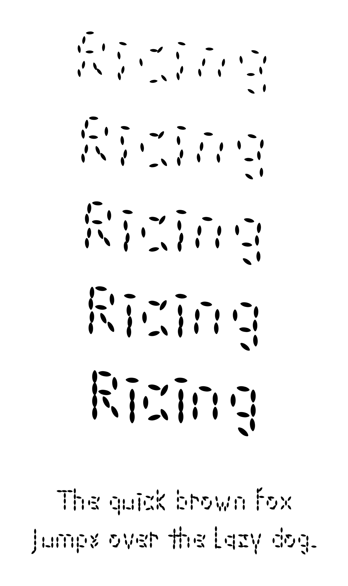

# Ricing

Every letter is composed of rice grain tapered ovals.

At `wght 900` the grains converge into recognisable letter shapes. At `wght 100`
they scatter apart, breaking the forms into abstract rice-like fragments.

## Download

**[Download Ricing 1.300](https://github.com/michaelsfonts/Ricing/releases/latest)** — the variable OTF to install on your computer, the variable WOFF2 for the web, or the zip, which also holds the nine static TTF weights.

The same files are in [`fonts/`](fonts/) if you would rather browse the repo.

## Details

- Released Mar 10, 2026
- 9 weights, Thin to Black
- Variable, single axis: `wght` 100–900
- Variable OTF and WOFF2, plus 9 static TTF
- Desktop and web use
- Was $5. Now free, and you can do whatever you like with it. See `LICENSE.txt`

---

Part of [Michael's Fonts](https://michaelsfonts.com). This repository is archived:
the font is finished and is kept here for reference.